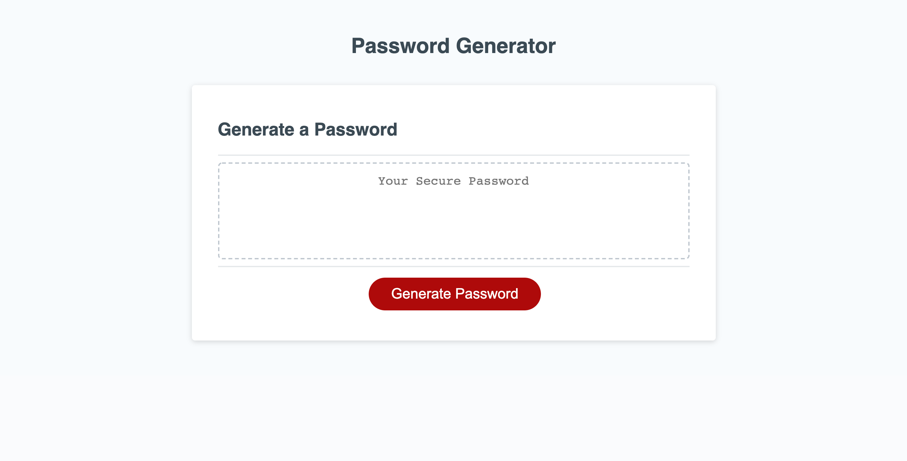

# Password Generator Starter Code

- Password Generator is an interactive webpage where a user can enter their desired length of password and choose from 4 input variables including uppercase, lowercase, numbers and symbols. The password is then randomly generated based upon their selected criteria. 

## Code Refactor Project

- In this project I was given basic starter code and was asked to add and modify the code to meet acceptence criteria.  Some of the changes I made include...

    1. declaring variables and creating object/method key_string.

    2. prompting user with options for desired length and character types and using 'while' loop to keep their answers with the required parameters.
    
    3. using 'if' conditional statements to retrieve user inputs and with an assignment operator "+=" concatenated the four different input types into one password of desired length.

    4. used Math operator (random + floor) to produce a random string that rounds to the lowest integer with the option for it to include up to 4 different input types. 

    5. created an array to iterate length user chose and randomize password.

    5. created a repository on GitHub at URL https://github.com/mmelendez3/password-generator

    6. This is the address of the live URL https://mmelendez3.github.io/password-generator/

    7. Here is a screenshot of the finished website.

        - 
